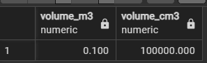

# SQL Задания для базы данных военных изделий (PostgreSQL 16)

## SQL-функции (1-3)

1. **Создать функцию для расчета объема изделия по его размерам**



   ```sql
   -- Создать функцию calculate_volume(dimension) RETURNS NUMERIC
   -- Ваш код здесь
   -- SELECT * FROM calculate_volume(ROW(1000, 500, 200));
   ```

2. **Создать функцию для определения возраста производителя**


   ```sql
   -- Создать функцию get_manufacturer_age(manufacturer_id INTEGER) RETURNS INTEGER
   -- Ваш код здесь
   -- SELECT * FROM get_manufacturer_age(1)
   ```

3. **Создать функцию для подсчета количества испытаний по типу**


   ```sql
   -- Создать функцию count_tests_by_type(test_type_param VARCHAR) RETURNS INTEGER
   -- Ваш код здесь
   -- SELECT * FROM count_tests_by_type('Летные испытания');
   ```

## SQL-функции с RETURNS TABLE (4-6)

4. **Создать функцию, возвращающую таблицу изделий по категории**


   ```sql
   -- Создать функцию get_products_by_category(category_name VARCHAR) 
   -- RETURNS TABLE(product_name VARCHAR, model VARCHAR, weight_kg NUMERIC)
   -- Ваш код здесь
   -- SELECT * FROM get_products_by_category('Стрелковое оружие');
   ```

5. **Создать функцию для получения статистики испытаний по изделию**


   ```sql
   -- Создать функцию get_product_test_stats(product_id INTEGER)
   -- RETURNS TABLE(total_tests INTEGER, passed_tests INTEGER, success_rate NUMERIC)
   -- Ваш код здесь
   --SELECT * FROM get_product_test_stats(1);
   ```

6. **Создать функцию для поиска изделий в диапазоне веса**
   ```sql
   -- Создать функцию get_products_by_weight_range(min_weight NUMERIC, max_weight NUMERIC)
   -- RETURNS TABLE(name VARCHAR, weight_kg NUMERIC, category_name VARCHAR)
   -- Ваш код здесь
   ```

## SQL-процедуры (7-9)

7. **Создать процедуру для добавления нового испытания**
   ```sql
   -- Создать процедуру add_test(product_id INTEGER, test_type VARCHAR, test_date DATE)
   -- Ваш код здесь
   ```

8. **Создать процедуру для обновления статуса изделия**
   ```sql
   -- Создать процедуру update_product_status(product_id INTEGER, new_status VARCHAR)
   -- Ваш код здесь
   ```

9. **Создать процедуру для архивации старых испытаний**
   ```sql
   -- Создать процедуру archive_old_tests(cutoff_date DATE)
   -- Ваш код здесь
   ```

## Рекурсивные SQL-функции (10)

10. **Создать рекурсивную функцию для генерации последовательности годов производства**
    ```sql
    -- Создать функцию generate_production_sequence(start_year INTEGER, end_year INTEGER)
    -- RETURNS TABLE(year INTEGER) с использованием рекурсивного CTE
    -- Ваш код здесь
    ```

## Работа с JSON и JSONB (11-12)

11. **Найти все изделия с определенным калибром в характеристиках**
    ```sql
    -- Запрос для поиска изделий с калибром "5.45x39" в JSON поле characteristics
    -- Ваш код здесь
    ```

12. **Обновить техническую характеристику в JSONB поле**
    ```sql
    -- Запрос для добавления нового поля "maintenance_hours" со значением 100 
    -- в technical_specs для всех изделий категории "Стрелковое оружие"
    -- Ваш код здесь
    ```

## Window функции (13)

13. **Ранжировать изделия по весу внутри каждой категории**
    ```sql
    -- Использовать ROW_NUMBER(), RANK(), DENSE_RANK() для ранжирования по весу
    -- Ваш код здесь
    ```

## GROUPING SETS, CUBE и ROLLUP (14-15)

14. **Создать отчет по количеству изделий с использованием ROLLUP**
    ```sql
    -- Использовать ROLLUP для группировки по стране производителя и категории
    -- Показать количество изделий на каждом уровне агрегации
    -- Ваш код здесь
    ```

15. **Создать сводный отчет по испытаниям с использованием CUBE**
    ```sql
    -- Использовать CUBE для анализа испытаний по типу теста и результату (passed)
    -- Показать количество испытаний для всех комбинаций
    -- Ваш код здесь
    ```