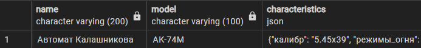

# SQL Задания для базы данных военных изделий (PostgreSQL 16)

## SQL-функции (1-3)

1. **Создать функцию для расчета объема изделия по его размерам**


   ```sql
   -- Создать функцию calculate_volume(dimension) RETURNS NUMERIC
   -- Ваш код здесь
  
  
  SELECT * FROM calculate_volume(ROW(1000, 500, 200));
   ```

2. **Создать функцию для определения возраста производителя**


   ```sql
   -- Создать функцию get_manufacturer_age(manufacturer_id INTEGER) RETURNS INTEGER
   -- Ваш код здесь
   
   
   SELECT * FROM get_manufacturer_age(1)
   ```

3. **Создать функцию для подсчета количества испытаний по типу**


   ```sql
   -- Создать функцию count_tests_by_type(test_type_param VARCHAR) RETURNS INTEGER
   -- Ваш код здесь
   
   
   SELECT * FROM count_tests_by_type('Летные испытания');
   ```

## SQL-функции с RETURNS TABLE (4-6)

4. **Создать функцию, возвращающую таблицу изделий по категории**


   ```sql
   -- Создать функцию get_products_by_category(category_name VARCHAR) 
   -- RETURNS TABLE(product_name VARCHAR, model VARCHAR, weight_kg NUMERIC)
   -- Ваш код здесь
   
   
   SELECT * FROM get_products_by_category('Стрелковое оружие');
   ```

5. **Создать функцию для получения статистики испытаний по изделию**


   ```sql
   -- Создать функцию get_product_test_stats(product_id INTEGER)
   -- RETURNS TABLE(total_tests INTEGER, passed_tests INTEGER, success_rate NUMERIC)
   -- Ваш код здесь

   SELECT * FROM get_product_test_stats(1);
   ```

6. **Создать функцию для поиска изделий в диапазоне веса**


   ```sql
   -- Создать функцию 
   CREATE OR REPLACE FUNCTION get_products_by_weight_range(
    IN min_weight NUMERIC,
    IN max_weight NUMERIC
)
RETURNS TABLE(name VARCHAR, weight_kg NUMERIC, category_name VARCHAR) AS $$
   -- Ваш код здесь

   SELECT * FROM get_products_by_weight_range(1, 10);
   ```

## SQL-процедуры (7-9)

7. **Создать процедуру и функцию для добавления нового испытания**


   ```sql
-- функция
CREATE OR REPLACE FUNCTION add_test(
    IN product_id INTEGER,
    IN test_type VARCHAR,
    IN test_date DATE
)
RETURNS TABLE ...

-- процедура
CREATE OR REPLACE PROCEDURE proc_add_test(
    IN product_id INTEGER,
    IN test_type VARCHAR,
    IN test_date DATE,
    OUT test_id INTEGER,
    OUT message TEXT
)
  


   CALL add_test(3, 'Новое испытание-3', '2024-01-01');
   SELECT * FROM proc_add_test(3, 'Новое испытание-3.1', '2024-01-01');
   ```

8. **Создать процедуру для обновления статуса изделия**


   ```sql
   -- Создать процедуру 
   CREATE OR REPLACE PROCEDURE update_product_status(
    IN product_id INTEGER,
    IN new_status VARCHAR)
  
   CALL update_product_status(1, 'inactive');
   ```

9. **Создать процедуру для архивации старых испытаний**


   ```sql
   -- Создать процедуру archive_old_tests(cutoff_date DATE)
   -- Ваш код здесь
   CALL archive_old_tests('2024-01-01');
   ```


## Работа с JSON и JSONB (11-12)

10. **Найти все изделия с определенным калибром в характеристиках**




```sql
-- Запрос для поиска изделий с калибром "5.45x39" в JSON поле characteristics

-- Ваш код здесь
```

11. **Найти все изделия с калибром больше 6 в характеристиках**


 ```sql
    -- Запрос для поиска изделий с калибром более 6 в характеристиках 
    -- Ваш код здесь
```

12. **Обновить техническую характеристику в JSONB поле**


```sql
-- Запрос для добавления нового поля "maintenance_hours" со значением 100 
-- в technical_specs для всех изделий категории "Стрелковое оружие"
-- Ваш код здесь

select technical_specs from military_products;
```

## Window функции (13)

13. **Ранжировать изделия по общему весу и весу внутри каждой категории **


```sql
-- Использовать ROW_NUMBER(), RANK(), DENSE_RANK() для ранжирования по весу
-- Ваш код здесь
```

## GROUPING SETS, CUBE и ROLLUP (14-15)

14. **Создать отчет по количеству изделий с использованием ROLLUP**


```sql
-- Использовать ROLLUP для группировки по стране производителя и категории
-- Показать количество изделий на каждом уровне агрегации
-- Ваш код здесь
```

15. **Создать сводный отчет по испытаниям с использованием CUBE**


```sql
-- Использовать CUBE для анализа испытаний по типу теста и результату (passed)
-- Показать количество испытаний для всех комбинаций
-- Ваш код здесь
```