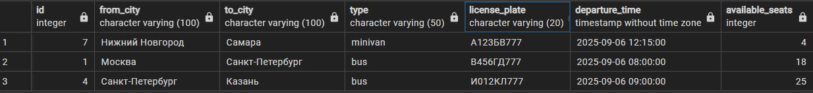
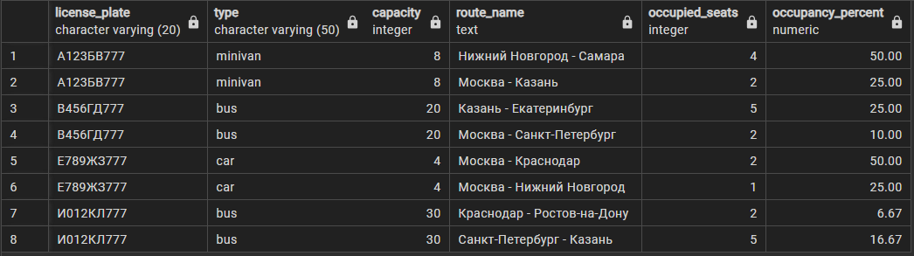
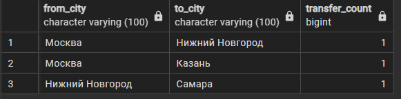

# SQL Задания для базы данных трансферных маршрутов

## Средний уровень (1-10)

1. **Найти все маршруты из Москвы с указанием названий городов назначения**


   ```sql
   -- Ваш запрос здесь
   ```

2. **Показать топ-3 самых дорогих маршрута с названиями городов**


   ```sql
   -- Ваш запрос здесь
   ```

3. **Найти все трансферы на завтра с информацией о маршруте и транспорте**



   ```sql
   -- Ваш запрос здесь
   ```

4. **Подсчитать общее количество доступных мест по каждому типу транспорта**


   ```sql
   -- Ваш запрос здесь
   ```

5. **Найти города, в которые нет прямых маршрутов из Москвы**


   ```sql
   -- Ваш запрос здесь
   ```

6. **Показать среднюю стоимость маршрута по каждому городу отправления**


   ```sql
   -- Ваш запрос здесь
   ```

7. **Найти все маршруты длительностью более 8 часов**


   ```sql
   -- Ваш запрос здесь
   ```

8. **Показать загруженность каждого транспортного средства (занятые места)**



   ```sql
   -- Ваш запрос здесь
   ```

9. **Найти ТОП-3 маршруты с самой высокой стоимостью за километр**


   ```sql
   -- Ваш запрос здесь
   ```

10. **Показать все трансферы, отправляющиеся в ближайшие 36 часов**


    ```sql
    -- Ваш запрос здесь
    ```

## Сложный уровень (11-20)

11. **Найти кратчайший путь между двумя городами через промежуточные остановки**


    ```sql
    -- Ваш запрос здесь
    ```

12. **Показать города с наибольшим количеством входящих и исходящих маршрутов**


    ```sql
    -- Ваш запрос здесь
    ```

13. **Найти все возможные маршруты из Москвы в Екатеринбург с одной пересадкой**


    ```sql
    -- Ваш запрос здесь
    ```

14. **Рассчитать среднюю заполненность транспорта по дням недели**


    ```sql
    -- Ваш запрос здесь
    ```

15. **Найти транспорт, который используется наиболее эффективно (высокая заполненность)**


    ```sql
    -- Ваш запрос здесь
    ```


16. **Показать топ-3 самых популярных направлений по количеству трансферов**




    ```sql
    -- Ваш запрос здесь
    ```

17. **Найти города-хабы (через которые проходит больше всего маршрутов)**


    ```sql
    -- Ваш запрос здесь
    ```

18. **Рассчитать потенциальную выручку по каждому маршруту при полной загрузке**


    ```sql
    -- Ваш запрос здесь
    ```

19. **Найти оптимальные маршруты по соотношению цена/время для каждой пары городов**


    ```sql
    -- Ваш запрос здесь
    ```

20. **Создать отчет по загруженности маршрутов с группировкой по месяцам**


    ```sql
    -- Ваш запрос здесь
    ```

## Дополнительные задания на модификацию данных


* **Создать представление для отображения актуальных маршрутов**